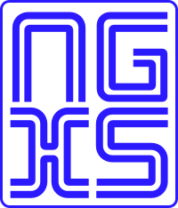

#  NGXS

<!-- Plugin description -->
NGXS is a state management library for Angular. This plugin provides NGXS CLI/Schematics for Jetbrains IDE.

> Please ensure you have [ngxs cli](https://www.ngxs.io/plugins/cli) installed either globally or at the project level.

# Features
- Simply right click -> New -> NGXS CLI/Schematics to generate a boiler plate store.
- Navigate to Action Implementation using Gutter Icons 
- Many more coming soon. Checkout roadmap

# Roadmap

- [ ] NPM install ngxs package when does not exist
- [ ] Live Templates

<!-- Plugin description end -->

## Installation

- Using the IDE built-in plugin system:

  <kbd>Settings/Preferences</kbd> > <kbd>Plugins</kbd> > <kbd>Marketplace</kbd> > <kbd>Search for "ngxs"</kbd> >
  <kbd>Install</kbd>

- Manually:

  Download the [latest release](https://github.com/dinbtechit/ngxs/releases/latest) and install it manually using
  <kbd>Settings/Preferences</kbd> > <kbd>Plugins</kbd> > <kbd>⚙️</kbd> > <kbd>Install plugin from disk...</kbd>

# How can I contribute

- By starring this Github project and rating the [NGXS plugin](https://plugins.jetbrains.com/plugin/22604-ngxs).
- By submitting bugs and features -> https://github.com/dinbtechit/ngxs/issues
- By submitting pull requests for the above roadmap items.
- By sponsoring its development to ensure that the project is actively maintained and improved.

> If you find this plugin useful consider sponsoring its development to ensure that the project is actively maintained
> and improved. [Buy me a Coffee](https://www.buymeacoffee.com/dinbtechit)

