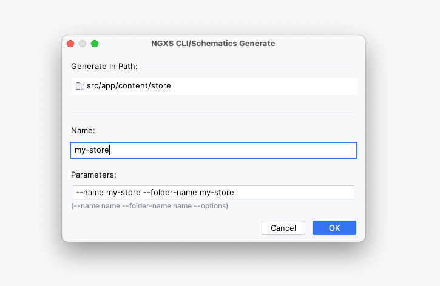
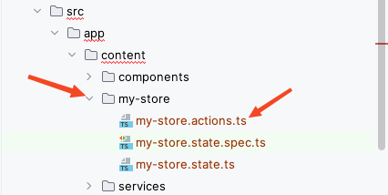
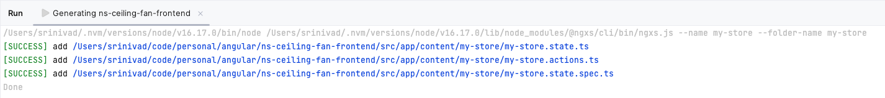

# CLI/Schematics

Helps to generate ngxs boilerplate store files (`store.state.ts`, `store.actions.ts` and `store.state.spec.ts`)

### How to use?

1. Right-click on any folder -> <kbd>new ></kbd> -> <kbd>NGXS CLI/Schematics</kbd>

   

2. Provide a **store name** and click <kbd>OK</kbd> to generate the boilerplate store

   

3. Generated Files

   

   

